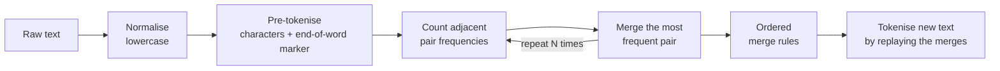

# 🎥 The Hidden Layers: Resources

**Code, notebooks and guides that go with the [Learn Hidden Layers](https://www.youtube.com/@LearnHiddenLayers) YouTube channel, where AI concepts are built from scratch and explained intuitively.**

[](https://www.youtube.com/@LearnHiddenLayers)


---

## About

Most AI tutorials stop at `import transformers`. **The Hidden Layers** goes one level deeper: every concept is built from first principles in plain Python, so you understand what the libraries are doing for you.

Each resource here goes with a video. Watch the explanation, then run the code yourself.

## Resources

| Topic | Resource | What you'll learn |
|---|---|---|
| **Tokenization** | [`byte_pair_encoding.ipynb`](byte_pair_encoding.ipynb) | How GPT-style tokenizers work, by implementing Byte Pair Encoding (BPE) from scratch |
| **Deep learning basics** | [Multi-class classification in PyTorch (PDF)](Training_a_Multi-Class_Classification_Model_in_PyTorch__A_Beginners_Guide.pdf) | A 20-page beginner's guide to training a multi-class classifier in PyTorch |

---

## 🔤 Byte Pair Encoding from scratch

The tokenizer is the first and most overlooked part of every LLM. This notebook builds one with no libraries:



**Training:** 500 merges on a short world-politics corpus grow the vocabulary from single characters to **533 tokens**. You can watch subwords form as the merges run (`in`, `pop`, `popul`, …).

**Inference:** new text is tokenised by applying the learned merge rules in order:

```python
>>> tokenize("All the lights we cannot see")
['all</w>', 'the</w>', 'li', 'g', 'h', 'ts</w>', 'w', 'e</w>', 'c', 'an', 'not</w>', 'se', 'e</w>']
```

Common words (`all`, `the`) become single tokens, while rarer words split into reusable subwords. That's the trade-off that lets LLMs handle any text with a fixed vocabulary.

**Run it:**

```bash
git clone https://github.com/JYOTSNACHOUDHARY/the-hidden-layers-resources.git
cd the-hidden-layers-resources
jupyter notebook byte_pair_encoding.ipynb
```

No dependencies beyond the Python standard library and Jupyter.

---

## Coming next

New resources are added as videos are published. **[Subscribe on YouTube](https://www.youtube.com/@LearnHiddenLayers)** to follow along, and star ⭐ this repo to get updates.

## License

[Apache License 2.0](LICENSE). You're free to use these materials for learning and teaching.

---

<p align="center">Built by <a href="https://github.com/JYOTSNACHOUDHARY">Jyotsna Choudhary</a> · <a href="https://www.linkedin.com/in/jyotsna-c/">LinkedIn</a> · <a href="https://www.youtube.com/@LearnHiddenLayers">YouTube</a></p>
